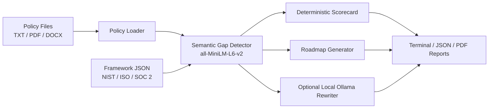

# POLARIS

[](https://www.python.org/)
[](LICENSE)
[](https://github.com/SudoXploit7/POLARIS/actions/workflows/ci.yml)
[](#testing)
[](#framework-support)
[](CHANGELOG.md)

**Policy Offline Lens for Assessment, Risk, and Improvement Scoring**

POLARIS is an offline cybersecurity policy gap analysis engine for security teams, auditors, and compliance practitioners. It evaluates policy documents against structured frameworks (NIST CSF 2.0, ISO 27001:2022, SOC 2) using local semantic embeddings, then produces deterministic scores, remediation roadmaps, rich terminal dashboards, JSON exports, and PDF reports — all without sending data to any external service.

---

## Demo

```text
$ python main.py --policy data/sample_policies/isms_policy.txt --framework nist_csf

 ──────────────── POLARIS Analysis: Isms Policy ────────────────
 Framework: NIST_CSF
 Maturity: 58.33% - Defined

                         Gap Analysis
 ┏━━━━━━━━━━┳━━━━━━━━━━┳━━━━━━━┳━━━━━━━━━━━━━━━━━━━━━━━━━━━━━━━━┓
 ┃ Control  ┃ Function ┃ Score ┃ Missing Clauses                ┃
 ┡━━━━━━━━━━╇━━━━━━━━━━╇━━━━━━━╇━━━━━━━━━━━━━━━━━━━━━━━━━━━━━━━━┩
 │ GV.OC-01 │ GOVERN   │     2 │ external dependencies          │
 │ PR.AA-01 │ PROTECT  │     3 │ None                           │
 │ RS.MA-01 │ RESPOND  │     1 │ escalation matrix, forensics   │
 └──────────┴──────────┴───────┴────────────────────────────────┘

                   Function Coverage Matrix
 ┏━━━━━━━━━━┳━━━━━━━┳━━━━━━━━━┳━━━━━━━━━┳━━━━━━━━━━┓
 ┃ Function ┃ Total ┃ Covered ┃ Missing ┃ Coverage ┃
 ┡━━━━━━━━━━╇━━━━━━━╇━━━━━━━━━╇━━━━━━━━━╇━━━━━━━━━━┩
 │ GOVERN   │     3 │       2 │       1 │   66.67% │
 │ PROTECT  │     4 │       4 │       0 │  100.00% │
 │ RESPOND  │     2 │       1 │       1 │   50.00% │
 └──────────┴───────┴─────────┴─────────┴──────────┘
```


---

## Architecture



---

## Quick Start

```bash
# 1. Install dependencies
pip install -r requirements.txt

# 2. Run against a sample policy (terminal output)
python main.py --policy data/sample_policies/isms_policy.txt --framework nist_csf

# 3. Export a PDF report for all sample policies
python main.py --all --framework nist_csf --format pdf
```

The first run downloads `all-MiniLM-L6-v2` (~90MB). All subsequent analysis is fully offline.

> **Optional:** Install [Ollama](https://ollama.com/download) and pull `mistral` for LLM-enhanced policy improvement text:
> ```bash
> ollama pull mistral
> ```

---

## CLI Reference

| Flag | Required | Default | Description |
|---|---|---|---|
| `--policy` | Yes (unless `--all`) | — | Policy path or glob pattern. Repeatable. |
| `--framework` | No | `nist_csf` | Framework key or path to a custom JSON. |
| `--output` | No | `outputs/<name>_<timestamp>` | Output file path for JSON or PDF. |
| `--format` | No | `terminal` | Output format: `terminal`, `json`, or `pdf`. |
| `--threshold` | No | `0.45` | Semantic similarity threshold (0.0–1.0). |
| `--all` | No | false | Run all four bundled sample policies. |
| `--verbose` | No | false | Show clause-level details and LLM improvements. |

Running `python main.py` with no arguments prints full help and exits cleanly.

**Examples:**

```bash
# Analyse a PDF policy and export JSON
python main.py --policy policies/access_control.pdf --format json

# Run with stricter matching
python main.py --policy policies/isms.docx --threshold 0.55

# Glob all TXT policies against ISO 27001
python main.py --policy "policies/*.txt" --framework iso27001 --format pdf

# Use a custom framework JSON
python main.py --policy my_policy.txt --framework path/to/custom_framework.json
```

---

## Output Formats

### Terminal (default)
Rich color-coded tables with maturity level, gap analysis, coverage matrix, and roadmap — designed for analyst workflows and quick reviews.

> **📸 Screenshot placeholder** — Add a screenshot of your Rich terminal output here.  
> Suggested path: `docs/screenshots/rich_terminal.png`

### PDF Report
Professional multi-section PDF including: cover page, executive summary, gap analysis table, improvement roadmap, NIST function coverage matrix, and LLM-enhanced policy improvement text.

> **📸 Screenshot placeholder** — Add a screenshot of the PDF report cover/summary page here.  
> Suggested path: `docs/screenshots/pdf_report.png`

A sample PDF report is included in the repository: [`sample_report.pdf`](sample_report.pdf)

### JSON Export
Structured machine-readable output for integration with SIEM tools, dashboards, or automation pipelines.

A sample JSON report is included: [`sample_output.json`](sample_output.json)

---

## Framework Support

| Framework | Version | Status | File |
|---|---|---|---|
| NIST Cybersecurity Framework | 2.0 | ✅ Supported | `data/frameworks/nist_cis_controls.json` |
| ISO 27001 Annex A | 2022 | ✅ Supported | `data/frameworks/iso27001_controls.json` |
| SOC 2 Trust Services Criteria | 2017 | ✅ Supported | `data/frameworks/soc2_controls.json` |
| GDPR | — | 🔜 Planned | — |
| HIPAA | — | 🔜 Planned | — |
| PCI DSS | — | 🔜 Planned | — |

### Adding a Custom Framework

Create a JSON file following this schema and pass it via `--framework path/to/file.json`:

```json
{
  "framework": "MY_FRAMEWORK",
  "version": "1.0",
  "controls": [
    {
      "id": "CTRL-1",
      "function": "GOVERN",
      "name": "Control Name",
      "description": "What this control expects.",
      "required_clauses": ["clause one", "clause two"],
      "risk_if_missing": "Optional risk statement."
    }
  ]
}
```

---

## Offline Design

POLARIS does not make external API calls during analysis.

- **Gap detection** uses `sentence-transformers` with `all-MiniLM-L6-v2`, which runs locally after the first model download.
- **Scoring and control coverage** are fully deterministic — the LLM touches nothing here.
- **Policy improvement text** (optional, `--verbose`) uses a locally installed Ollama model. If Ollama is absent, POLARIS falls back to a static, compliance-safe clause automatically.

This design makes POLARIS safe for use with confidential policy documents.

---

## Policy File Formats

| Format | Support |
|---|---|
| Plain text (`.txt`) | ✅ |
| PDF (`.pdf`) | ✅ (via pdfplumber; strips headers/footers) |
| Word Document (`.docx`) | ✅ (via python-docx; includes table text) |

---

## Project Structure

```
POLARIS/
├── .github/workflows/ci.yml     ← GitHub Actions CI
├── data/
│   ├── frameworks/               ← NIST CSF, ISO 27001, SOC 2 JSON
│   └── sample_policies/          ← Four sample policy .txt files
├── engine/
│   ├── gap_detector.py           ← Semantic clause matching (MiniLM)
│   ├── policy_loader.py          ← TXT / PDF / DOCX ingestion
│   ├── policy_rewriter.py        ← LLM improvement dispatch
│   ├── roadmap_generator.py      ← Short / mid / long-term roadmap
│   └── scorecard.py              ← Coverage matrix and maturity scoring
├── llm/
│   ├── local_llm.py              ← Ollama subprocess wrapper
│   └── prompts.py                ← Prompt templates
├── output/
│   └── report_generator.py       ← JSON and PDF export
├── tests/                        ← pytest suite (80%+ coverage)
├── docs/screenshots/             ← Screenshots for README
├── main.py                       ← CLI entry point (Click)
├── pyproject.toml
├── requirements.txt
├── sample_output.json            ← Example JSON report
└── sample_report.pdf             ← Example PDF report
```

---

## Testing

```bash
# Run full test suite with coverage
pytest --cov=engine --cov=output --cov-report=term-missing

# Run a specific test file
pytest tests/test_gap_detector.py -v
```

The test suite uses a lightweight deterministic `HashingEmbeddingModel` fallback so tests run without downloading the sentence-transformer model. All tests work fully offline.

---

## Contributing

See [CONTRIBUTING.md](CONTRIBUTING.md) for development setup, the framework JSON schema, and pull request expectations.

**Quick summary:**
- Gap detection and scoring must remain deterministic
- No external API calls in analysis paths
- Include tests for any new ingestion, scoring, or framework behaviour
- Update `CHANGELOG.md` for user-facing changes

---

## Roadmap

- [ ] Web UI for interactive policy review
- [ ] GDPR, HIPAA, and PCI DSS framework packs
- [ ] API mode for local automation pipelines
- [ ] Evidence mapping and control-owner assignment workflows
- [ ] Semantic threshold auto-tuning per framework

---

## Changelog

See [CHANGELOG.md](CHANGELOG.md) for version history.

---

## License

MIT — see [LICENSE](LICENSE).
